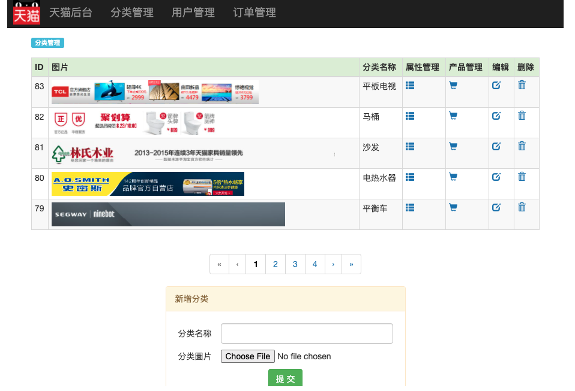

# Tmall Java Web Development Document

****

[toc]


## 0. Project Development Procedure

****

模仿天猫整站是一个比较大的项目，将按照商业项目的开发流程有条不紊的一一展开：

1. 需求分析
   首先确定要做哪些功能，需求分析包括[前台](https://how2j.cn/k/tmall-j2ee/tmall-j2ee-898/898.html)和[后台](https://how2j.cn/k/tmall-j2ee/tmall-j2ee-941/941.html)。
   前台又分为单纯要展示的那些功能-[需求分析-展示](https://how2j.cn/k/tmall-j2ee/tmall-j2ee-898/898.html)，以及会提交数据到服务端的哪些功能-[需求分析-交互](https://how2j.cn/k/tmall-j2ee/tmall-j2ee-940/940.html)。

2. 表结构设计
   接着是表结构设计，表结构设计是围绕功能需求进行，如果表结构设计有问题，那么将会影响功能的实现。除了[表与表关系](https://how2j.cn/k/tmall-j2ee/tmall-j2ee-944/944.html)，[建表SQL语句](https://how2j.cn/k/tmall-j2ee/tmall-j2ee-945/945.html)之外，为了更好的帮助大家理解表结构以及关系，还特意把[表与页面功能](https://how2j.cn/k/tmall-j2ee/tmall-j2ee-947/947.html)一一对应起来

3. 原型
   接着是界面原型，与客户沟通顺畅的项目设计流程里一定会有原型这个环节。 借助界面原型，可以**低成本，高效率**的与客户达成需求的一致性。 同样的，原型分为了[前台原型](https://how2j.cn/k/tmall-j2ee/tmall-j2ee-948/948.html)和[后台原型](https://how2j.cn/k/tmall-j2ee/tmall-j2ee-971/971.html)。

4. 实体类设计
   接着开始[实体类的设计与开发](https://how2j.cn/k/tmall-j2ee/tmall-j2ee-972/972.html)，实体类不仅仅是对数据库中的表的一一映射，同时还需要兼顾对业务功能的支持。

5. DAO类设计
   然后是[DAO类的设计](https://how2j.cn/k/tmall-j2ee/tmall-j2ee-983/983.html)，除了进行典型的ORM支持功能之外，也需要提供各种业务方法。

6. 业务类介绍
   讲解的[业务类](https://how2j.cn/k/tmall-j2ee/tmall-j2ee-995/995.html)的概念，以及为什么在本项目中没有包含这一层

7. 后台-分类管理
   接下来开始进行功能开发，按照模块之间的依赖关系，首先进行[后台-分类管理](https://how2j.cn/k/tmall-j2ee/tmall-j2ee-996/996.html)功能开发。严格来说，这是开发的第一个功能，所以讲解的十分详细，不仅提供了[可运行的项目](https://how2j.cn/k/tmall-j2ee/tmall-j2ee-997/997.html)，还详细解释了其中用到的[设计模式](https://how2j.cn/k/tmall-j2ee/tmall-j2ee-998/998.html)，[JSP包含关系](https://how2j.cn/k/tmall-j2ee/tmall-j2ee-1006/1006.html)，以及每个具体的功能： [查询](https://how2j.cn/k/tmall-j2ee/tmall-j2ee-999/999.html)，[分页](https://how2j.cn/k/tmall-j2ee/tmall-j2ee-1000/1000.html)，[增加](https://how2j.cn/k/tmall-j2ee/tmall-j2ee-1001/1001.html)，[删除](https://how2j.cn/k/tmall-j2ee/tmall-j2ee-1002/1002.html)，[编辑](https://how2j.cn/k/tmall-j2ee/tmall-j2ee-1003/1003.html)，[修改](https://how2j.cn/k/tmall-j2ee/tmall-j2ee-1004/1004.html)。 把每个细节都掰的很细，可以更好的理解，消化和吸收。 在把[后台-分类管理](https://how2j.cn/k/tmall-j2ee/tmall-j2ee-996/996.html) 吃透之后，后续的其他后台管理功能，做起来就会更加顺畅。

8. 后台-其他管理
   在把[后台-分类管理](https://how2j.cn/k/tmall-j2ee/tmall-j2ee-996/996.html) 消化吸收之后，就可以加速进行 [后台其他页面](https://how2j.cn/k/tmall-j2ee/tmall-j2ee-1008/1008.html)的学习。

9. 前台-首页
   前台也包括许多功能， 与[后台-分类管理](https://how2j.cn/k/tmall-j2ee/tmall-j2ee-996/996.html)类似的，首先把[前台-首页](https://how2j.cn/k/tmall-j2ee/tmall-j2ee-1015/1015.html)这个功能单独拿出来，进行精讲。[前台-首页](https://how2j.cn/k/tmall-j2ee/tmall-j2ee-1015/1015.html) 消化吸收好之后，再进行其他前台功能的开发。
10. 前台无需登录
    从前台模块之间的依赖性，以及开发顺序的合理性来考虑，把前台功能分为了 [无需登录](https://how2j.cn/k/tmall-j2ee/tmall-j2ee-1022/1022.html) 即可使用的功能，和[需要登录](https://how2j.cn/k/tmall-j2ee/tmall-j2ee-1029/1029.html) 才能访问的功能。 建立在前一步[前台-首页](https://how2j.cn/k/tmall-j2ee/tmall-j2ee-1015/1015.html)的基础之上，开始进行一系列的[无需登录](https://how2j.cn/k/tmall-j2ee/tmall-j2ee-1022/1022.html)功能开发。

11. 前台需要登录
    最后是[需要登录的前台功能](https://how2j.cn/k/tmall-j2ee/tmall-j2ee-1029/1029.html)。 这部分功能基本上都是和购物相关的。 因此，一开始先把[购物流程](https://how2j.cn/k/tmall-j2ee/tmall-j2ee-1029/1029.html) 单独拿出来捋清楚，其中还特别注明了[购物流程环节与表关系](https://how2j.cn/k/tmall-j2ee/tmall-j2ee-1029/1029.html#step3954)，这样能够更好的建立对前端购物功能的理解。随着这部分功能的开发，就会进入订单生成部分，在此之前，先准备了一个 [订单状态图](https://how2j.cn/k/tmall-j2ee/tmall-j2ee-1043/1043.html#step3978)，在理解了这个图之后，可以更好的进行订单相关功能的开发。

12. 总结
    最后总结整个项目的项目结构，都实现了哪些典型场景，运用了哪些设计模式，把学习到的知识都沉淀下来，转换，消化，吸收为自己的技能

### Tomcat7 + jdk 1.8 + JDBC + Servlet + JSP + Bootstrap + JQuery


****

## 1. Analysis of Project Needs 

首先需要进行项目需求分析，研究出有什么需求，并思考如何实现各类需求。

**本项目 分为两部分组成：1. 与客户交互的前台，2.与管理员交互的后台**

### I. Front-Stage: for customer

1. 前端展示
   在前端页面上显示数据库中的数据，如首页，产品页，购物车，分类页面等等。
   至于这些前端页面如何组织显示，页面布局，css样式设置，Javascript交互代码等教学，在单独的[模仿天猫前端教程](https://how2j.cn/k/tmall-front/tmall-front-790/790.html)中详细讲解。
   分开学习和讲解，降低学习的难度，避免全部前后端混杂在一起学带来的困扰。

2. 前端交互
   这里的前端交互，与[模仿天猫前端教程](https://how2j.cn/k/tmall-front/tmall-front-790/790.html)里的交互，不是同一个概念。 [模仿天猫前端教程](https://how2j.cn/k/tmall-front/tmall-front-790/790.html)里的交互，仅仅停留在浏览器上的javascript交互，这里的交互指的是通过POST,GET等http协议，与服务端进行同步或者异步数据交互。 比如购买，购物车，生成订单，登录等等功能。

   

   绿色表示**展示**的需求
   红色表示与服务器有**交互**的需求

>1. 首页
>
>2. - 在横向导航栏上提供4个分类连接
>   - 在纵向导航栏上提供全部17个分类连接
>   - 当鼠标移动到某一个纵向分类连接的时候，显示这个分类下的推荐商品
>   - 按照每种分类，显示5个商品的方式显示所有17种分类
>
>3. 产品页
>
>4. - 显示分辨率为950x100的当前商品对应的分类图片
>   - 显示本商品的5个单独图片
>   - 商品的基本信息，如标题，小标题，价格，销量，评价数量，库存等
>   - 商品详情
>   - 评价信息
>   - 5张商品详细图片
>   - 立即购买
>   - 加入购物车
>
>5. 分类页
>
>6. - 显示分辨率为950x100的当前分类图片
>   - 显示本分类下的所有产品
>   - 分类页排序
>
>7. 搜索结果页
>
>8. - 显示满足查询条件的商品
>
>9. 购物车查看页
>
>10. - 在购物车中显示订单项
>    - 调整订单项数量
>    - 删除订单项
>
>11. 结算页
>
>12. - 在结算页面显示被选中的订单项
>    - 生成订单
>
>13. 确认支付页
>
>14. - 确认支付页面显示本次订单的金额总数
>    - 确认付款
>
>15. 支付成功页
>
>16. - 付款成功时，显示本次付款金额
>
>17. 我的订单页
>
>18. - 显示所有订单，以及对应的订单项
>
>19. 确认收货页
>
>20. - 显示订单项内容
>    - 显示订单信息，收货人地址等
>    - 确认收货
>
>21. 评价页
>
>22. - 显示要评价的商品信息，商品当前的总评价数
>    - 评价成功后，显示当前商品所有的评价信息
>    - 提交评价信息
>
>23. 页头信息展示
>
>24. - 未登录状态
>    - 已登录状态
>    - 登录
>    - 注册
>    - 退出
>
>25. 所有页面
>
>26. - 搜索


### II. Back-Stage: for admin

3. 后台功能
   对支撑整站需要用到的数据，进行管理维护。 比如分类管理，分类属性管理， 产品管理，产品图片管理，用户管理，订单管理等等。

>1. 分类管理
>
>2. - 分页查询
>   - 新增分类
>   - 编辑修改
>   - 删除
>
>3. 属性管理
>
>4. - 属性概念
>   - 分页查询
>   - 新增属性
>   - 编辑修改
>   - 删除
>
>5. 产品管理
>
>6. - 分页查询
>   - 新增产品
>   - 编辑修改
>   - 删除
>
>7. 产品图片管理
>
>8. - 产品图片概念
>   - 产品图片管理
>
>9. 产品属性设置
>
>10. - 产品属性值设置
>
>11. 用户管理
>
>12. - 分页查询
>
>13. 订单管理
>
>14. - 订单分页查询
>    - 查看详情
>    - 发货

****

## 2. Development - Database Design

### I. Table Structure Design

1. [数据库的创建](https://how2j.cn/k/tmall-j2ee/tmall-j2ee-943/943.html)
2. [表与表关系](https://how2j.cn/k/tmall-j2ee/tmall-j2ee-944/944.html)
3. [建表SQL语句](https://how2j.cn/k/tmall-j2ee/tmall-j2ee-945/945.html)
4. [表与页面](https://how2j.cn/k/tmall-j2ee/tmall-j2ee-947/947.html)

import a database：

```shell
mysql -u root -p tmall < tmall.sql
```

| Table Name     | Brief                                                        |
| -------------- | ------------------------------------------------------------ |
| Category       | Item category information such as clothes, TV, sofa and so on. |
| Property       | Item property information such as color, weight              |
| Product        | Item name and information                                    |
| Property Value | Item property value                                          |
| Product Image  | EveryItem has five images to describe                        |
| Review         | Item review information                                      |
| User           | User Infromation Table                                       |
| Order          | Order Information, such as addr. phone number                |
| OrderItem      | OrderItem information, such as quantity and so on            |


#### create a database and set default encoding to UTF-8

```mysql
DROP DATABASE IF EXISTS tmall;
CREATE DATABASE tmall DEFAULT CHARACTER SET utf8;
```

#### create all the tables and set primary key and foreign key according to the relationship

Since, we have some certain relationship we need to reference. We need to create tables in a certain order.

(Topological Sort)

1. user table - for user id and login

   

```mysql
# create user table
# user table:
# user id UNIQUE NOT NULL AUTO_INCREMENT
# name and password

DROP TABLE IF EXISTS user;
CREATE TABLE user (
  id int(11) UNIQUE NOT NULL AUTO_INCREMENT,
  name varchar(255) DEFAULT NULL,
  password varchar(255) DEFAULT NULL,
  PRIMARY KEY (id)
) ENGINE=InnoDB DEFAULT CHARSET=utf8;
```

2. category table - for product category

   

   item category such as clothes, slippery

```mysql

DROP TABLE IF EXISTS category;
CREATE TABLE category (
  id int(11) UNIQUE NOT NULL AUTO_INCREMENT,
  name varchar(255) DEFAULT NULL,
  PRIMARY KEY (id)
) ENGINE=InnoDB  DEFAULT CHARSET=utf8;

```

3. property table - for product property 

   

   a foreign key constraint: `CONSTRAINT fk_property_category FOREIGN KEY (cid) REFERENCES category (id)`

   ```mysql
   DROP TABLE IF EXISTS property;
   CREATE TABLE property (
     id int(11) UNIQUE NOT NULL AUTO_INCREMENT,
     cid int(11) DEFAULT NULL,
     name varchar(255) DEFAULT NULL,
     PRIMARY KEY (id),
     CONSTRAINT fk_property_category FOREIGN KEY (cid) REFERENCES category (id)
   ) ENGINE=InnoDB DEFAULT CHARSET=utf8;
   ```

4. Product table

   

   a foreign key constraint: `CONSTRAINT fk_item_category FOREIGN KEY (cid) REFERENCES category (id)`

```mysql
DROP TABLE IF EXISTS product;
CREATE TABLE product (
  id int(11) UNIQUE NOT NULL AUTO_INCREMENT,
  name varchar(255) DEFAULT NULL,
  subTitle varchar(255) DEFAULT NULL,
  orignalPrice float DEFAULT NULL,
  promotePrice float DEFAULT NULL,
  stock int(11) DEFAULT NULL,
  cid int(11) DEFAULT NULL,
  createDate datetime DEFAULT NULL,
  PRIMARY KEY (id),
  CONSTRAINT fk_product_category FOREIGN KEY (cid) REFERENCES category (id)
) ENGINE=InnoDB  DEFAULT CHARSET=utf8;
```

5. propertyValue table - values of the property

   

This table is very import since we could not put all the properties into the product table since it would make the product table extremely large and hard to maintain.

Thus, here, we use a property value table to connect the property table and product table.  We use ptid to reference the property table id and pid to reference the product table id. 

Thus, we could use this to describe a product has certain property with a specific value.

```mysql
CREATE TABLE propertyvalue (
  id int(11) NOT NULL AUTO_INCREMENT,
  pid int(11) DEFAULT NULL,
  ptid int(11) DEFAULT NULL,
  value varchar(255) DEFAULT NULL,
  PRIMARY KEY (id),
  CONSTRAINT fk_propertyvalue_property FOREIGN KEY (ptid) REFERENCES property (id),
  CONSTRAINT fk_propertyvalue_product FOREIGN KEY (pid) REFERENCES product (id)
) ENGINE=InnoDB  DEFAULT CHARSET=utf8;
```

6. product image table

   

   This table does not store the image. Instead, it only refers to single photo or detail photo.

   Of course, it needs to reference the primary key of the product table,

   ```mysql 
   CREATE TABLE productimage (
     id int(11) NOT NULL AUTO_INCREMENT,
     pid int(11) DEFAULT NULL,
     type varchar(255) DEFAULT NULL,
     PRIMARY KEY (id),
     CONSTRAINT fk_productimage_product FOREIGN KEY (pid) REFERENCES product (id)
   ) ENGINE=InnoDB DEFAULT CHARSET=utf8;
   ```

7. review table

   

   It is another complex relationship we need to solve. The review is generated by a certain user and it points to a certain product. We could not insert this to the product table, since it would be too large for a product table and it is hard to manipulate. Thus, we need a review table to connect this two tables.

   ```mysql
   DROP TABLE IF EXISTS review;
   CREATE TABLE review (
     id int(11) NOT NULL AUTO_INCREMENT,
     content varchar(4000) DEFAULT NULL,
     uid int(11) DEFAULT NULL,
     pid int(11) DEFAULT NULL,
     createDate datetime DEFAULT NULL,
     PRIMARY KEY (id),
     CONSTRAINT fk_review_product FOREIGN KEY (pid) REFERENCES product (id),
       CONSTRAINT fk_review_user FOREIGN KEY (uid) REFERENCES user (id)
   ) ENGINE=InnoDB  DEFAULT CHARSET=utf8;
   ```

8. order table - for admin 

   

   ```mysql
   CREATE TABLE order_ (
     id int(11) NOT NULL AUTO_INCREMENT,
     orderCode varchar(255) DEFAULT NULL,
     address varchar(255) DEFAULT NULL,
     post varchar(255) DEFAULT NULL,
     receiver varchar(255) DEFAULT NULL,
     mobile varchar(255) DEFAULT NULL,
     userMessage varchar(255) DEFAULT NULL,
     createDate datetime DEFAULT NULL,
     payDate datetime DEFAULT NULL,
     deliveryDate datetime DEFAULT NULL,
     confirmDate datetime DEFAULT NULL,
     uid int(11) DEFAULT NULL,
     status varchar(255) DEFAULT NULL,
     PRIMARY KEY (id),
     CONSTRAINT fk_order_user FOREIGN KEY (uid) REFERENCES user (id)
   ) ENGINE=InnoDB  DEFAULT CHARSET=utf8;
   ```

9. orderItem table - for shopping cart

   

   ```mysql
   CREATE TABLE orderitem (
     id int(11) NOT NULL AUTO_INCREMENT,
     pid int(11) DEFAULT NULL,
     oid int(11) DEFAULT NULL,
     uid int(11) DEFAULT NULL,
     number int(11) DEFAULT NULL,
     PRIMARY KEY (id),
     CONSTRAINT fk_orderitem_user FOREIGN KEY (uid) REFERENCES user (id),
     CONSTRAINT fk_orderitem_product FOREIGN KEY (pid) REFERENCES product (id)
   ) ENGINE=InnoDB  DEFAULT CHARSET=utf8;
   ```

   

   Currently, the tmall database is not sensitive to upper/lower class. The database will automatically transform the name to lower case for querying.

## 3. Developement - JavaWeb Desing

### Three-Layer Design


### I. Java Bean ORM Entity 

所谓的实体类，就是对于数据库中的表的互相映射的类。

**这是一种[ORM](https://how2j.cn/k/jdbc/jdbc-orm/391.html)的设计思想，即**一个对象**，对应数据库里的**一条记录

基于前面数据库表结构的分析和设计，根据[创建表的SQL语句](https://how2j.cn/k/tmall-j2ee/tmall-j2ee-945/945.html)，和[表与页面一一对应关系](https://how2j.cn/k/tmall-j2ee/tmall-j2ee-947/947.html),按照表与表之间的依赖顺序，逐个设计总计九个实体类。


>## java web中读取properties文件时的路径问题
>
>在web开发时，难免会有一些固定的参数，我们一般把这些固定的参数存在properties文件中，然后用的时候要读出来。但经常出现一些错误，找不到相应的路径，所以，今天特地讲一些如何正确获得路径。
>
>
>
>首先，我们要将properties文件部署在$app/WEB-INF/classes文件夹里，比如将info.properties文件放在dingding这个web应用下时，该文件所在的路径为$dingding/WEB-INF/classes/info.properties。
>
>然后读取的时候分为两种情况读取：
>
>### （一）在Servlet类中的读取: 他们不存在与classes中是因为，他们由servlet容器生成并管理
>
>有两种读取方式：
>
>1.直接将properties文件读入的流中
>
>```java
>InputStream in = **this**.getServletContext().getResourceAsStream("/WEB-INF/classes/info.properties"); 
>Properties prop = **new** Properties(); 
>prop.load(in); 
>prop.getProperty("username")
>```
>
>2.获得properties文件的路径，然后在用流读出
>
>```java
>String path = this.getServletContext().getRealPath("/WEB-INF/classes/info.properties"); 
>FileInputStream in = new FileInputStream(path); 
>Properties prop = new Properties(); 
>prop.load(in); 
>prop.getProperty("username"); 
>
>```
>
>
>
>推荐第二种方法，易于理解。
>
>### （二）在非Servlet类中（普通java类中）的读取
>
>也有两种读取方式：
>
>1.直接将文件装载到内存中
>
>```java
>InputStream in = Demo.class.getClassLoader().getResourceAsStream("db.properties"); 
>Properties prop = new Properties(); 
>prop.load(in); 
>prop.getProperty("username"); 
>```
>
>但存在一些缺陷:类装载器加载内容时,会先查找内存中是否已经存在相应的内容，如果有就不再 加载直接使用内存中的,所以此方法,第一次加载后,如果文件内容有变动,第二次加载后还是原来的内容,无法加载修改后的内容。下边的方法取文件的绝对路径来加载不会有这种问题。
>
>2.读取到文件的路径，然后用流读出
>
>```java
>String path = Demo.class.getClassLoader().getResource("info.properties").getPath(); 
>FileInputStream in = new FileInputStream(path); 
>Properties prop = new Properties(); 
>prop.load(in); 
>prop.getProperty("username"); 
>```
>
>上面在使用FileInputStream时传入的都是绝对路径,也可以使用相对路径:
>普通java工程:是相对于当前类的所在路径
>
>web工程:是相对于$tomcat/bin    ($tomcat为tomcat的路径名)

For every table, we have created a Java Bean for data object relationship mapping. Thus, each instance could stands for a record in table.

for further use in DAO all the beans extends an abstract class called Bean as their public class template


### II. Utils 

##### Naive JDBC - No Connection Pool

```java

/**
 * A Utils class for DB connection
 */

public class DBUtils {
    // through properties file load db connection parameters into the system
    static String ip;
    static int port;
    static String database;
    static String encoding_format;
    static String loginName;
    static String password;
    static String driverClassName;

    static {
        // step 1 : load properties Document
        Properties properties = new Properties();

        InputStream in = null;
        try {
            // properties file must be placed in the classes file in output
          // use reflection to access properties file
            in = Thread.currentThread().getContextClassLoader().getResourceAsStream("db.properties");
            properties.load(in);
            in.close();
        } catch (IOException e) {
            e.printStackTrace();
        }
        ip = properties.getProperty("ip","127.0.0.1");
        port = Integer.parseInt(properties.getProperty("port","3306"));
        database = properties.getProperty("database");
        encoding_format = properties.getProperty("encoding_format");
        loginName = properties.getProperty("loginName");
        password = properties.getProperty("password");
        driverClassName = properties.getProperty("driverClassName");
    }


    static {
        try {
            // it needs to import the mysql driver via maven pom.xml
            Class.forName(driverClassName);
        } catch (ClassNotFoundException e) {
            e.printStackTrace();
        }
    }

    public static Connection getConnection() throws SQLException {
        // it needs to import the mysql driver via maven pom.xml
        // database url: jdbc:mysql://ip:port/database?characterEncoding=UTF-8
        String url = String.format("jdbc:mysql://%s:%d/%s?characterEncoding=%s", ip, port, database, encoding_format);
        // for each connection, we need to init a new connection
        return DriverManager.getConnection(url, loginName, password);
    }

    // for test only
    public static void main(String[] args) throws SQLException {
        System.out.println(getConnection());

    }

}
```

`db.properties` file

```properties
# database ip
ip=127.0.0.1
# database port number
port=3306
# dbname
database=tmall
# encoding
encoding_format=UTF-8
loginName=root
password=hjay1996
driverClassName=com.mysql.jdbc.Driver
```

##### Use Druid Database Connection Pool - for higher performance

```java
public class DBConnPoolUtils {
    private static DataSource dataSource;

    static {
        // load properties
        Properties properties = new Properties();
      // use reflection to access properties file
        InputStream in = DBConnPoolUtils.class.getClassLoader().getResourceAsStream("druid.properties");
        try {
            properties.load(in);
            in.close();
        } catch (IOException e) {
            e.printStackTrace();
        }
        // use DruidDataSourceFactory to create dataSource
        // the properties argument needs to be in the standard way:https://www.cnblogs.com/wuyun-blog/p/5679073.html
        try {
            dataSource = DruidDataSourceFactory.createDataSource(properties);
        } catch (Exception e) {
            e.printStackTrace();
        }
    }

    /**
     * get datasource
     */

    public static DataSource getDataSource(){
        return dataSource;
    }

    /**
     * get connection from connection pool
     *
     */
    public static Connection getConnection() throws SQLException {
        return dataSource.getConnection();
    }

	// for test only
    public static void main(String[] args) {
        try {
            System.out.println(DBConnPoolUtils.getConnection());
        } catch (SQLException e) {
            e.printStackTrace();
        }
    }
  
  
  /**
  * helper: release resources after service
  */
  public static void free(ResultSet rs, Statement st, Connection conn) {
        try {
            if (rs != null)
                rs.close();
        } catch (SQLException e) {
            e.printStackTrace();
        } finally {
            try {
                if (st != null)
                    st.close();
            } catch (SQLException e) {
                e.printStackTrace();
            } finally {
                if (conn != null)
                    try {
                        conn.close();
                    } catch (Exception e) {
                        e.printStackTrace();
                    }
            }
        }
    }


```

`druid.properties` file

```properties
driverClassName=com.mysql.jdbc.Driver
url=jdbc:mysql://127.0.0.1:3306/tmall?characterEncoding=UTF-8
username=root
password=hjay1996
initialSize=5
maxActive=10
maxWait=3000
encoding=UTF-8
```


a primitive Connection Pool

```java
public class ConnectionPool {
  
    List<Connection> cs = new ArrayList<Connection>();
  
    int size;
  
    public ConnectionPool(int size) {
        this.size = size;
        init();
    }
  
    public void init() {
          
        //it can't be try-with-resources block since it needs to be alive 
        try {
            Class.forName("com.mysql.jdbc.Driver");
            for (int i = 0; i < size; i++) {
                Connection c = DriverManager
                        .getConnection("jdbc:mysql://127.0.0.1:3306/how2java?characterEncoding=UTF-8", "root", "admin");
                cs.add(c);
            }
        } catch (ClassNotFoundException e) {
            // TODO Auto-generated catch block
            e.printStackTrace();
        } catch (SQLException e) {
            // TODO Auto-generated catch block
            e.printStackTrace();
        }
    }
  
    public synchronized Connection getConnection() {
        while (cs.isEmpty()) {
            try {
              	// release cs resources temporarily
                this.wait();
            } catch (InterruptedException e) {
                // TODO Auto-generated catch block
                e.printStackTrace();
            }
        }
        Connection c = cs.remove(0);
        return c;
    }
  
    public synchronized void returnConnection(Connection c) {
        cs.add(c);
      	// notifyAll waiting thread could continue
        this.notifyAll();
    }
  
}
```

#### GlobalParameters Class for Passing Parameters into Class

（1）内部静态类不需要有指向外部类的引用。但非静态内部类需要持有对外部类的引用。

（2）非静态内部类能够访问外部类的静态和非静态成员。静态类不能访问外部类的非静态成员。他只能访问外部类的静态成员。

（3）一个非静态内部类不能脱离外部类实体被创建，一个非静态内部类可以访问外部类的数据和方法，因为他就在外部类里面。

```java
// use static class for passing parameters
// it could also be used as configuration file
public class GlobalParameters {

    public static class OrderStatus{
        public static final String WAITPAY = "waitPay";
        public static final String WAITDELIVERY = "waitDelivery";
        public static final String WAITCONFIRM = "waitConfirm";
        public static final String WAITREVIEW = "waitReview";
        public static final String FINISH = "finish";
        public static final String DELETED = "delete";

    }

    public static class DBUtilsParameters{
        // database ip
        public static final String ip = "127.0.0.1";
        // database port number
        public static final int port=3306;
        //dbname
        public static final String database="tmall";
        // encoding
        public static final String  encoding_format="UTF-8";
        public static final String loginName="root";
        public static final String   password="hjay1996";
        public static final String driverClassName = "com.mysql.jdbc.Driver";
        public static final String url = "jdbc:mysql//ip:port/dbname?CharacterEncoding=UTF-8";
    }

    // useless, properties is more useful for druid
    public static class DBConnUtilsParameters{
        public static final String driverClassName= "com.mysql.jdbc.Driver";
        public static final String  url= "jdbc:mysql://127.0.0.1:3306/tmall?characterEncoding=UTF-8";
        public static final String username="root";
        public static final String password="hjay1996";
        public static final int initialSize= 5;
        public static final int maxActive=10;
        public static final int maxWait=3000;
        public static final String encoding="UTF-8";
    }
}


```


### III. DAO Layer - Data Accessing Object

#### 0. DAOInterface - CRUD

```java

public  interface  DAO {
    // return a Bean
    public Bean getById(int id);

    // add a record
    public void add( Bean bean_father);

    // delete a record
    public void delete(int id);

    // return a list contains all beans -> for generic
    public List<? extends Bean> list() throws SQLException;

    // return a list contains beans for pagin
    public List<? extends Bean> list(int start, int count) throws SQLException;

    // update a record
    public void update(Bean bean_father);

    // return the number of all records
    public int getTotal();
}

```

#### 2. UserDAO


### IV. Service Layer

In this project, the basic logic of Service has been realized by the DAO. Thus, the Service layer is not implemented.


### V. Web Layer - Brief

#### 1.  Category & Prodcut Management



##### DIsplay Every Category


##### Product Management


##### Product Photo Management


##### Prodcut Category Management


#### 2. User Management


#### 3. Order Management


### VII. Development of Back-Stage Admin System

到这里就开始讲解功能开发了。 开发整站的顺序，通常来说还是按照依赖性来进行，前端需要的数据，都要先通过后台的功能维护在数据库中，才可以拿到。
所以，先进行后台功能的开发，然后再是前台功能的开发。

后台在系统设计的时候，并不是简单的每个功能对应一个Servlet，而是使用了反射的技术，结合过滤器Filter进行了封装，使得开发配置以及维护成本降低了很多。 所以在讲解第一个后台功能-分类管理的时候，就会花相当的篇幅来解构后台的功能是如何设计的。

为了便于大家理解和消化这部分知识，采用如下节奏进行

1. 首先下载一个只有分类管理的可运行项目，先跑起来看看效果

2. 理解BackServletFilter+BaseBackServlet这种设计模式
3. 再以查询为例子，运用这种设计模式，并且分析其带来的好处
4. 分页功能单独拿出来讲解
5. 最后讲解分类管理中其他的，增加，删除，编辑和修改功能


#### Servlet + Filter Design Pattern

通过观察http://127.0.0.1:8080/tmall/admin_category_list 可以发现，分类管理需要：增加，删除，编辑，修改，查询5个服务端功能。那么按照传统的[在web.xml中配置Servlet的方式](https://how2j.cn/k/servlet/servlet-eclipse/558.html#step1573)，一个路径对应一个Servlet的思路，就需要设计5个Servlet类，并且在web.xml中配置5个路径

 

AddCategoryServlet

DeleteCategoryServlet

EditCategoryServlet

UpdateCategoryServlet

ListCategoryServlet


而后台需要做分类，产品，属性，产品图片，用户，订单这么6种管理，那么就一共需要30个Servlet，以及在web.xml中对应的配置，那么配置文件就会变得臃肿，并且容易出错


但是观察已经实现了分类管理的[可运行项目下载包](https://how2j.cn/k/tmall-j2ee/tmall-j2ee-997/997.html)里的代码，却发现Servlet只有一个即CategoryServlet，web.xml里，也只有一个CategoryServlet的映射，并没有5个映射。

如图是对于最后完工了的项目的servlet包里类的截图，可以发现，每种实体类，对应了一个Servlet，而不是对应了5个，这样首先从Servlet数量上来讲，就大大的减少了


#### Flowchart 

那么是如何做到一个CategoryServlet类，就能完成本来需要5个Servlet类才能完成的功能的呢？

让我们借助流程图来分析，为什么访问admin_category_list的时候，CategoryServlet的list()方法会被调用

1. 假设访问路径是 http://127.0.0.1:8080/tmall/admin_category_list
2. 过滤器BackServletFilter进行拦截，判断访问的地址是否以/admin_开头
3. 如果是，那么做如下操作
   3.1 取出两个下划线之间的值 category
   3.2 取出最后一个下划线之后的值 list
   3.3 然后根据这个值，服务端跳转到categoryServlet，并且把list这个值传递过去
4. categoryServlet 继承了BaseBackServlet，其service方法会被调用。 在service中，借助反射技术，根据传递过来的值 list，调用对应categoryServlet 中的方法list()
5. 这样就实现了当访问的路径是 admin_category_list的时候，就会调用categoryServlet.list()方法这样一个效果

换句话说:
如果访问的路径是admin_category_add，就会调用categoryServlet.add()方法
如果访问的路径是admin_category_delete，就会调用categoryServlet.delete()方法
如果访问的路径是admin_category_edit，就会调用categoryServlet.edit()方法
如果访问的路径是admin_category_update，就会调用categoryServlet.update()方法
如此这般，一个categoryServlet类，就完成了本来需要5个Servlet类才能完成的功能。


## 代码讲解 - BackServletFilter

那么BackServletFilter类到底是如何工作的呢？ 接下来我们此类进行代码讲解。

1. 首先在web.xml配置文件中，让所有的请求都会经过BackServletFilter

\<url-pattern>/*\</url-pattern>

2. 还是假设访问的路径是：

http://127.0.0.1:8080/tmall/admin_category_list

3. 在BackServletFilter 中通过request.getRequestURI()取出访问的uri: /tmall/admin_category_list
4. 然后截掉/tmall，得到路径/admin_category_list
5. 判断其是否以/admin开头
6. 如果是，那么就取出两个_之间的字符串，category，并且拼接成/categoryServlet，通过服务端跳转到/categoryServlet
7. 在跳转之前，还取出了list字符串，然后通过request.setAttribute的方式，借助服务端跳转，传递到categoryServlet里去


 步骤 **5** : 

## 代码讲解 - CategoryServlet和BaseBackServlet

[**顶**](https://how2j.cn/k/tmall-j2ee/tmall-j2ee-998/998.html#)[**折**](https://how2j.cn/k/tmall-j2ee/tmall-j2ee-998/998.html#nowhere)

[**纠**](https://how2j.cn/k/tmall-j2ee/tmall-j2ee-998/998.html#nowhere)[**问**](https://how2j.cn/k/tmall-j2ee/tmall-j2ee-998/998.html#nowhere)

接着流程就到了categoryServlet这里。

根据web.xml中的配置

 

<servlet-name>CategoryServlet</servlet-name>

<url-pattern>/categoryServlet</url-pattern>

 


服务端跳转/categoryServlet就到了CategoryServlet这个类里

\1. 首先CategoryServlet继承了BaseBackServlet，而BaseBackServlet又继承了HttpServlet
\2. 服务端跳转过来之后，会访问CategoryServlet的doGet()或者doPost()方法
\3. 在访问doGet()或者doPost()之前，会访问service()方法
\4. BaseBackServlet中重写了service() 方法，所以流程就进入到了service()中
\5. 在service()方法中有三块内容
5.1 第一块是获取分页信息
5.2 第二块是根据[反射](https://how2j.cn/k/reflection/reflection-class/108.html)访问对应的方法
5.3 第三块是根据对应方法的返回值，进行服务端跳转、客户端跳转、或者直接输出字符串。
\6. 第一块和第三块放在后面讲解，这里着重讲解第二块是根据反射访问对应的方法
6.1 取到从BackServletFilter中request.setAttribute()传递过来的值 list
6.2 根据这个值list，借助[反射机制](https://how2j.cn/k/reflection/reflection-method/109.html)调用CategoryServlet类中的list()方法
这样就达到了CategoryServlet.list()方法被调用的效果

- [CategoryServlet.java](https://how2j.cn/k/tmall-j2ee/tmall-j2ee-998/998.html#nowhere)
- [BaseBackServlet.java](https://how2j.cn/k/tmall-j2ee/tmall-j2ee-998/998.html#nowhere)
- [web.xml代码片段](https://how2j.cn/k/tmall-j2ee/tmall-j2ee-998/998.html#nowhere)

代码比较复制代码

[代码行数较多，请点击查看 ](https://how2j.cn/k/tmall-j2ee/tmall-j2ee-998/998.html#nowhere)


 步骤 **6** : 

## 一个Servlet类就能满足CRUD一系列业务要求

[**顶**](https://how2j.cn/k/tmall-j2ee/tmall-j2ee-998/998.html#)[**折**](https://how2j.cn/k/tmall-j2ee/tmall-j2ee-998/998.html#nowhere)

[**纠**](https://how2j.cn/k/tmall-j2ee/tmall-j2ee-998/998.html#nowhere)[**问**](https://how2j.cn/k/tmall-j2ee/tmall-j2ee-998/998.html#nowhere)

通过这样一种模式，一个Servlet类就能满足CRUD一系列业务要求
如果访问的路径是admin_category_list，就会调用categoryServlet.list()方法
如果访问的路径是admin_category_add，就会调用categoryServlet.add()方法
如果访问的路径是admin_category_delete，就会调用categoryServlet.delete()方法
如果访问的路径是admin_category_edit，就会调用categoryServlet.edit()方法
如果访问的路径是admin_category_update，就会调用categoryServlet.update()方法


