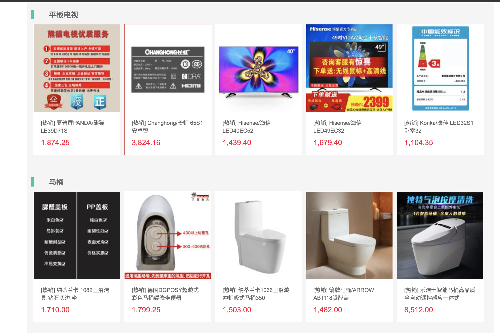
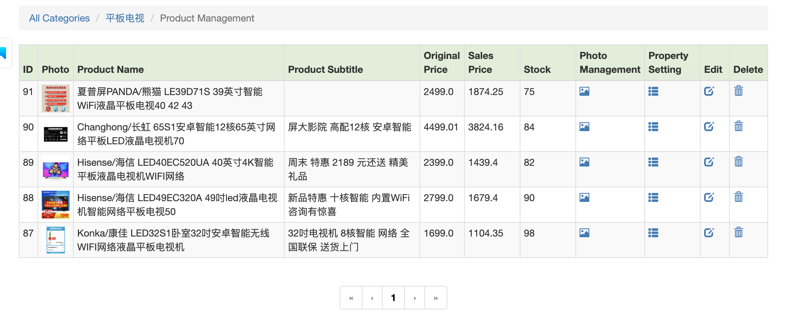
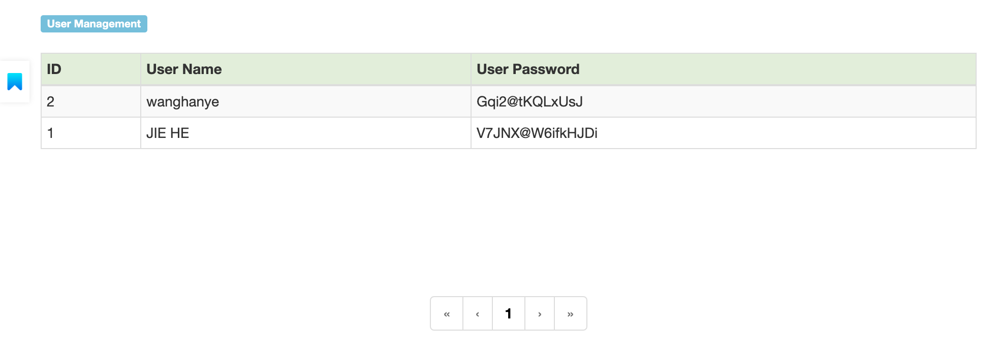

# TMall_JavaWeb
A full-stack web application implementing MVC pattern based on JavaEE JSP, built with Maven.

Please Reference the Development Document for development detail.

## Front-Stage - For User

### Home Page (No Need to Sign In)

### Home Page Product List (No Need to Sign In)

### Search (No Need to Sign In)

Search for refrigerators, generate the list for refrigerators.

### User Sign In

### User Sign Up

### Home Page After Sign In

### Product Details 

> Product Purchase Page

> Product Detail Page

### Shopping Cart (Need to Sign In)

### User Orders Management -

>  user could check all the order (paid, delivery, confirm, review ). User could also manage the orders, delete the orders.

### User Check Out Page

> User needs to fill in detail address, zip code, receiver name, and  phone number 

### Order Payment Page

### Successful Payment Page

### User Order Status 

> User could check the status of the orders.

### Review of the orders

## Back-Stage - For Admin

### Item Management based on Product Category

### Product Management

### Product Property Management

### Product Picture Management

## User Management

## Order Managment

> The admins could manage the orders.

> The admin could see the details of all the orders.

